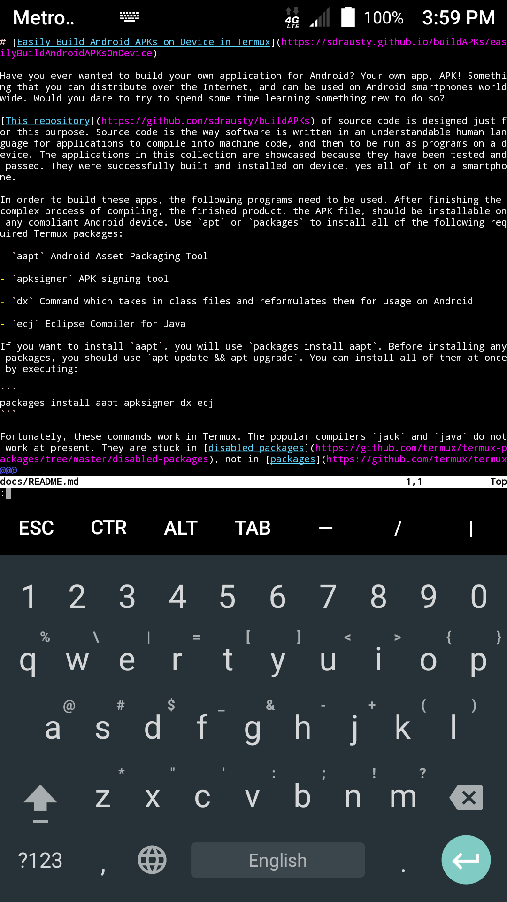
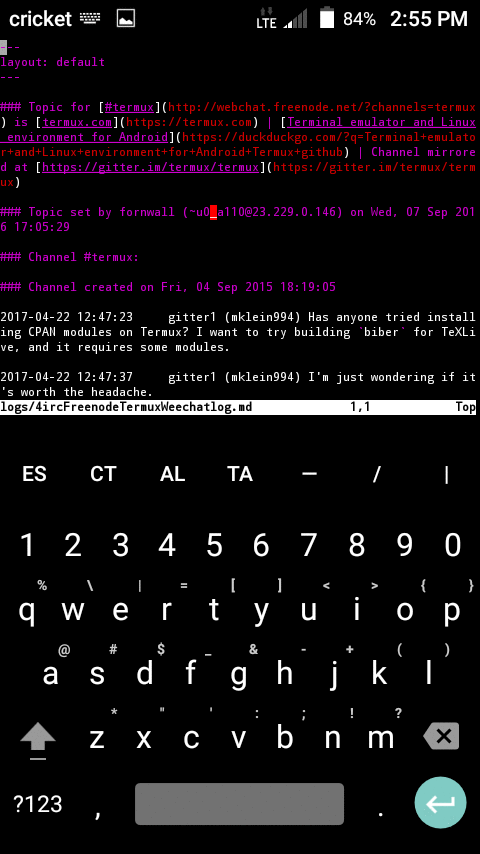

# [Easily Build Android APKs on Device in Termux](https://sdrausty.github.io/docsBuildAPKs/easilyBuildAndroidAPKsOnDevice)

Have you ever wanted to build your own application for Android on Android? Your own app, APK! Something that you can distribute over the Internet, and can be used on Android smartphones worldwide. Would you dare to try to spend some time learning something new to do so?


[This project](https://github.com/buildAPKs) is designed just for this purpose. Source code is the way software is written in an understandable human language for applications to compile into machine code, and then to be run as programs on a device. The applications in this collection are showcased because they have been tested and passed. They were successfully built and installed on device, yes all of it on a smartphone.

In order to build these apps, the following programs need to be used. After finishing the complex process of compiling, the finished product, the APK file, should be installable on any compliant Android device. Use `apt` or `packages` to install all of the following required Termux packages:

- `aapt` Android Asset Packaging Tool

- `apksigner` APK signing tool

- `dx` Command which takes in class files and reformulates them for usage on Android

- `ecj` Eclipse Compiler for Java

If you want to install `aapt` you will use `packages install aapt`. Before installing any packages, you should use `apt update && apt upgrade`. You can install all of them at once by executing:

```
packages install aapt apksigner dx ecj
```

Fortunately, these commands work in Termux. The popular compilers `jack` and `java` do not work at present. They are stuck in [disabled packages](https://github.com/termux/termux-packages/tree/master/disabled-packages), not in [packages](https://github.com/termux/termux-packages/tree/master/packages) that you can install on the fly. There is active discussion regarding why `jack` is stuck [here](https://github.com/termux/termux-packages/issues?utf8=✓&q=is%3Aissue%20%20jack), and why `java` is stranded [there.](https://github.com/termux/termux-packages/issues?utf8=✓&q=is%3Aissue%20%20java)

You may be wondering now after installing the necessary packages and downloading the source code:

```
cd && git clone https://github.com/sdrausty/buildAPKs
```

What do I do next? How do I use `aapt`, the Android Asset Packaging Tool, `apksigner`, the APK signing tool, `dx`, the command which takes in class files and reformulates them for usage on Android and `ecj`, the Eclipse Compiler for Java?

[This project](https://github.com/sdrausty/buildAPKs) has [bash scripts](https://github.com/SDRausty/buildAPKs/tree/master/scripts/bash/build) which help immensely in automating work. Make them executable by `chmod 750 script.sh` if they are not already. Check to see their permissions with `ls -al`. Then simply run `build.one.bash` in the directory of the program you wish to make by calling it by name. Look for the `AndroidManifest.xml` file. That is where you want to run the [bash script.](https://github.com/sdrausty/buildAPKs/blob/master/buildOne.sh) After you are done building the app, install it **from** your `/sdcard/Download/builtAPKs` directory through your file manager in Android.

If your system does not have a file manager, Open File Manager is available at [F-droid.](https://f-droid.org/packages/com.nexes.manager/) You can download, install and use it. Source code for this APK (Android Package Kit) is available [here](https://github.com/sdrausty/buildAPKsApps/tree/master/browsers/Android-File-Manager) at buildAPKsApps, a submodule of buildAPKs. If you prefer [Ghost Commander,](https://f-droid.org/packages/com.ghostsq.commander/) the souce code is available [here.](https://github.com/sdrausty/buildAPKsBrowsers/tree/master/ghostcommander-code) Both APKs build beautifully on device (a smartphone) in your pocket with [Termux.](https://termux.com) We should really leave the age of whirling fans and disk drives behind.

Enjoy this project! Inscribe your feedback at the [wiki,](https://github.com/sdrausty/buildAPKs/wiki) the [issues pages](https://github.com/sdrausty/buildAPKs/issues) and through [the code itself.](https://github.com/sdrausty/buildAPKs/pulls) 

#### When you press and momentarily hold the `volumeDown+power` buttons simultaneously on a smartphone, it takes a screenshot much like this one which shows the screen and the [the source code for this page](https://raw.githubusercontent.com/sdrausty/buildAPKs/master/docs/README.md) in [vim](http://www.vim.org/git.php) running on [Termux](./pages/asac) on [Android.](https://source.android.com/)



#### This animation was created with [imagemagick](https://sdrausty.github.io/pages/im.html) in [Termux](https://sdrausty.github.io/pages/asac.html) on an Android smartphone.



If you're confused by this page try [this link,](http://tldp.org/) or you might want to try [this one.](https://www.debian.org/doc/) Post your what you have found at [the wiki,](https://github.com/sdrausty/buildAPKs/wiki) [donate](https://sdrausty.github.io/pages/donate) and help [this website grow!](https://sdrausty.github.io/)

- [Termux on F-droid!](https://f-droid.org/packages/com.termux/) Please do not mix your installation of Termux between Google Play and F-droid. There are [compatibility issues.](https://github.com/termux/termux-api/issues/53)

[Up One Level](./../)

🛳⛴🛥🚢🚤🚣⛵

